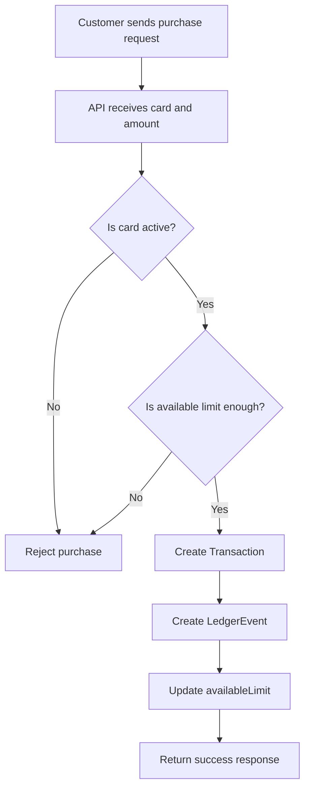
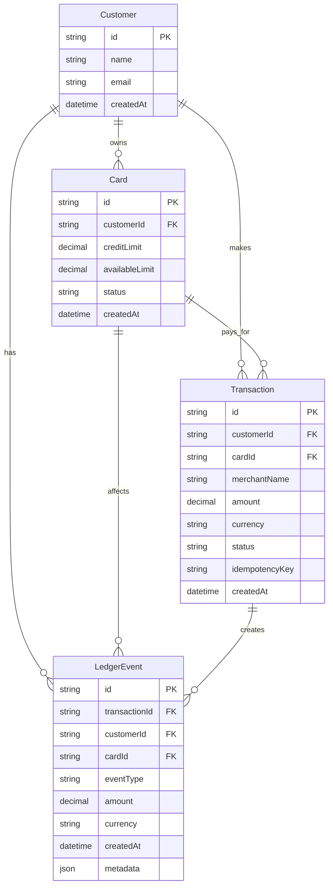

# API

This is the NestJS API for the credit card learning project.

## Project Setup

```bash
$ npm install
```

## Run The API

```bash
$ npm run start
$ npm run start:dev
```

## Run Tests

```bash
$ npm run test
$ npm run test:e2e
$ npm run test:cov
```

## Credit Card Purchase Flow

This is the simple Phase 1 purchase story:

1. A customer uses a card to make a purchase.
2. The API checks that the card exists and can be used.
3. The system creates a `Transaction` record for the purchase.
4. The system creates a `LedgerEvent` record to preserve the money history.
5. The system returns the result so the client can show it.

The key idea is:

- `Transaction` tells us what happened.
- `LedgerEvent` makes the money history permanent.
- `Card.availableLimit` shows how much credit is still left.

## Purchase Flow Diagram



## Database Diagram

This is the current Phase 1 database shape.



## Simple Explanation

- `Customer` is the person.
- `Card` is the payment tool the customer uses.
- `Transaction` is the purchase record.
- `LedgerEvent` is the permanent money-history record.

The important idea is this:

```text
Customer makes the purchase.
Card is used for the purchase.
Transaction records what happened.
LedgerEvent preserves the money story.
```
